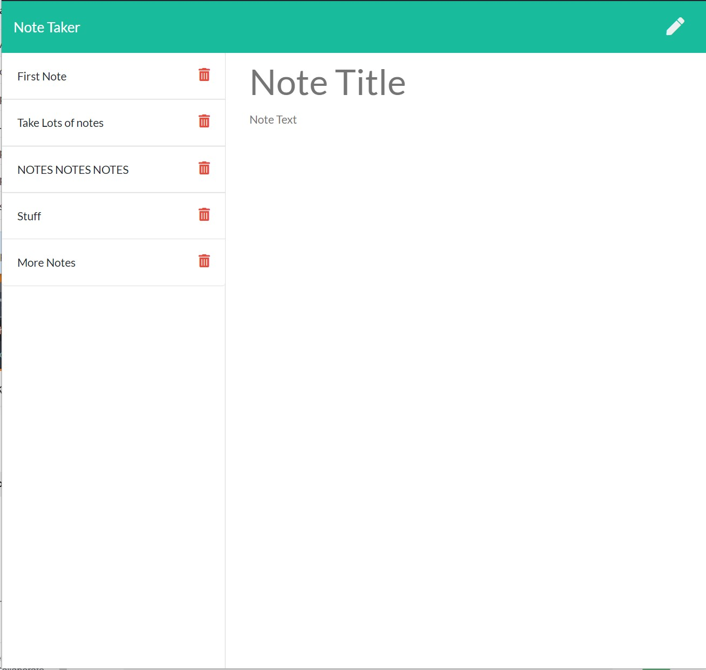

# Note Taker

## Description

Keep track of all your thoughts and ideas with this simple to use Note Taker. Save, delete, and create new notes. 

## How to Use: 

Simply click the pencil icon to create a new note. 

After you have entered your note, the save icon becomes available. 

Save your new note, it will appear on the left side of the screen for later use. 

Delete notes by clicking on the red trash can. 

## Github Repo Link
https://github.com/adamnatrop/note_taker

## Screenshots 

